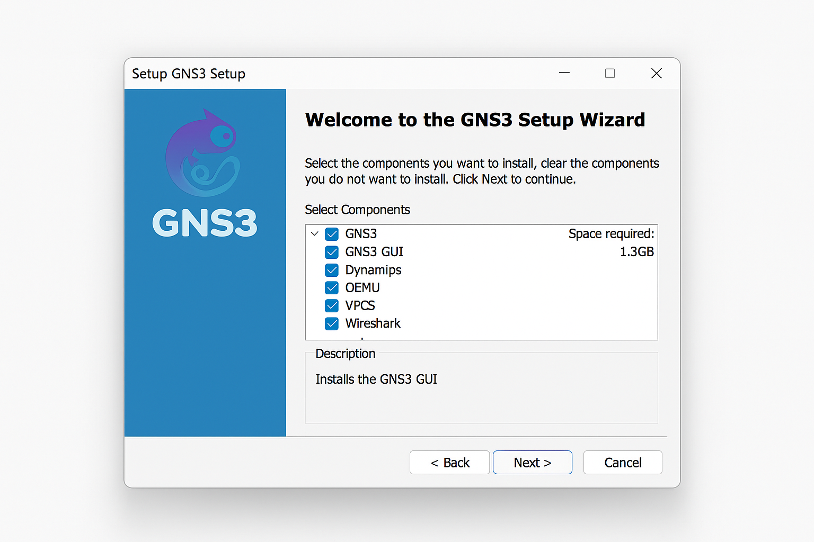
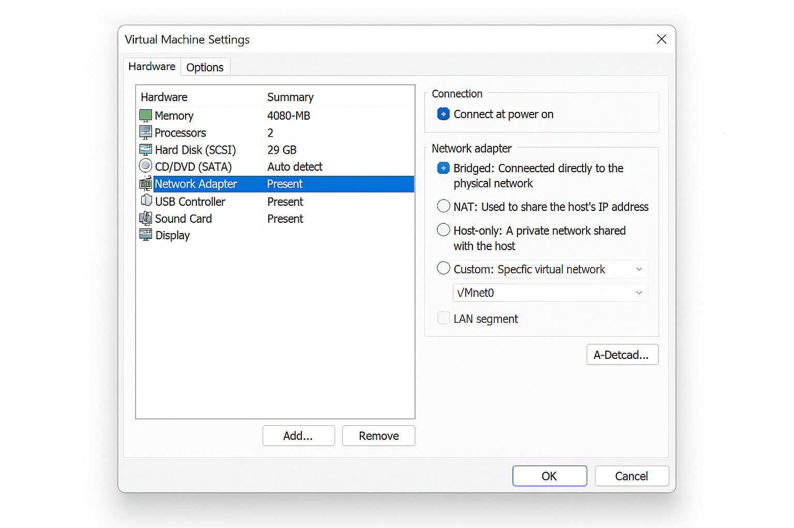
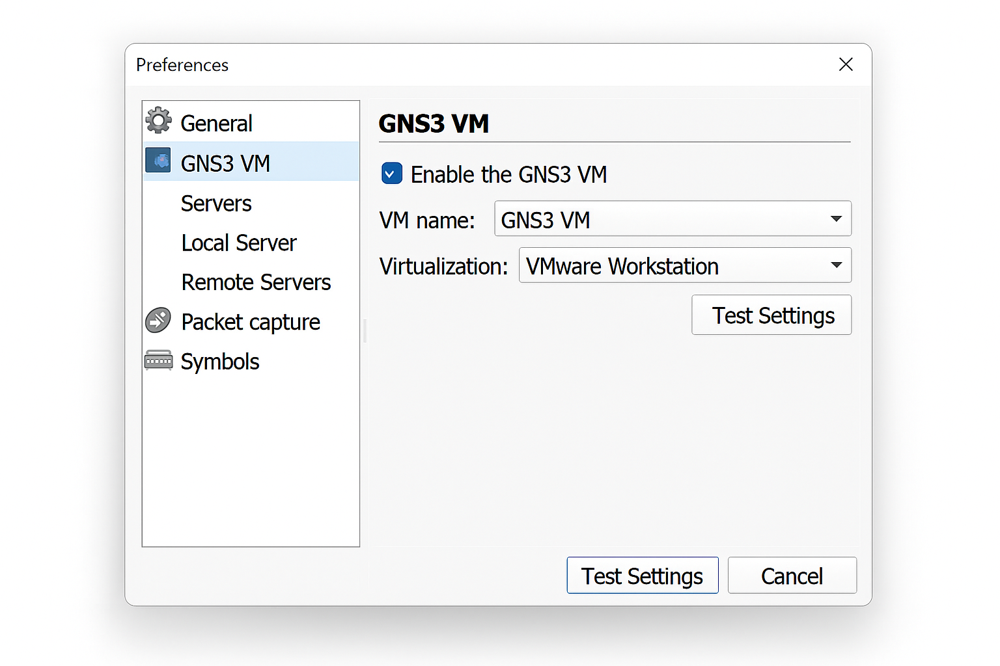

# Guía de Instalación de GNS3 con GNS3 VM en VMware Workstation (Windows)

## 🧰 Requisitos Previos

- Windows 10 o superior
- VMware Workstation Pro o Player
- GNS3 instalado
- GNS3 VM (archivo .ova) descargado

---

## 📦 Paso 1: Instalar GNS3 en Windows

1. Descarga el instalador desde [gns3.com](https://www.gns3.com/software/download).
2. Ejecuta el instalador como administrador.
3. Instala todos los componentes recomendados:
   - GNS3 GUI
   - Dynamips
   - QEMU
   - VPCS
   - Wireshark (opcional)

---

## 🖥️ Paso 2: Importar GNS3 VM en VMware Workstation

1. Abre VMware Workstation.
2. Ve a **File > Open** y selecciona el archivo `.ova` de GNS3 VM.
3. Asigna un nombre a la VM (por ejemplo, `GNS3-VM`) y haz clic en **Import**.
4. Edita la configuración de la VM:
   - CPU: mínimo 2 núcleos
   - RAM: mínimo 4 GB
   - Red: adaptador en modo **Bridge** o **Host-only**

---

## 🔗 Paso 3: Configurar GNS3 para usar la GNS3 VM

1. Abre GNS3.
2. Ve a **Edit > Preferences > GNS3 VM**.
3. Marca **Enable the GNS3 VM**.
4. Selecciona **VMware Workstation** como tipo de virtualización.
5. Asegúrate de que el nombre de la VM coincida (`GNS3-VM`).
6. Haz clic en **Test Settings**.

---

## 🧪 Paso 4: Verificar la conexión

- Si todo está correcto, verás el mensaje: **GNS3 VM is running and connected**.

---

## ✅ Listo para usar

Ya puedes importar imágenes como Cisco IOSv, IOU, etc. y comenzar tus laboratorios.

---
